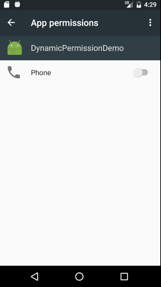
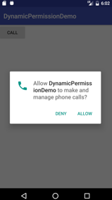
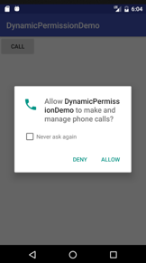

# Android 运行时请求权限


> 从 Android 6.0（API 级别 23）开始，用户开始在应用运行时向其授予权限，首先在清单文件中列出我们所需要的权限，如果是正常权限，系统会自动授予，如果是[危险权限](https://developer.android.com/guide/topics/security/permissions.html#normal-dangerous)，则需要在运行得到用户的批准。 

## 什么是权限
首先假设有个功能，点击按钮拨打电话。

```java
findViewById(R.id.btn_call).setOnClickListener(new View.OnClickListener() {
	@Override
	public void onClick(View v) {
  		Intent intent = new Intent(Intent.ACTION_CALL);
  		Uri data = Uri.parse("tel:" + "000000000");
  		intent.setData(data);
  		startActivity(intent);
	}
});
```  
拨打电话需要 `android.permission.CALL_PHONE` 这个权限，我们需要将其配置到清单文件中。

```xml
<uses-permission android:name="android.permission.CALL_PHONE"/>
```  

**没有配置**   
运行时会崩溃，报`java.lang.SecurityException: Permission Denial`  异常，这一点在任何版本的android系统上都是一样的  
  
**配置完成**   
  
* 6.0 以下版本的Android系统上，可以成功拨打电话
* 6.0 及以上版本的Android系统上，依旧崩溃，还是报了`java.lang.SecurityException: Permission Denial`的异常

对于6.0以上的手机，我们进入手机的应用管理，找到我们的应用，然后进入权限控制，发现拨打电话权限并没有处于开启的状态。   
  
然后我们手动开启权限，再回到应用，这时，果然可以正常拨打电话了。于是乎，我们告诉用户，安装完成我们的应用之后，请你通过设置进入应用管理，然后找到我们的应用，进入权限管理，开启拨打电话的权限。听完后用户默默的选择了卸载。  

## 检查和申请权限
Android 框架从 Android 6.0（API 级别 23）开始提供了**检查和请求权限**的方法,不过我们通常使用support库来完成,因为使用支持库更简单，因为在调用方法前，应用不需要检查它在哪个版本的 Android 上运行。   

### 检查权限  
#### [`checkSelfPermission`](https://developer.android.com/reference/android/support/v4/content/ContextCompat.html#checkSelfPermission(android.content.Context,%20java.lang.String))  

我们需要`ContextCompat`类的 `checkSelfPermission` 方法来检查当前手机是否拥有某个权限
  
我们来调整我们的代码  

``` java
    @Override
    public void onClick(View v) {
        if(ContextCompat.checkSelfPermission(this, Manifest.permission.CALL_PHONE) != PackageManager.PERMISSION_GRANTED){
            //没有 CALL_PHONE 权限
        }else{
            //拥有 CALL_PHONE 权限
            callPhone();
        }
    }

    public void callPhone(){
        Intent intent = new Intent(Intent.ACTION_CALL);
        Uri data = Uri.parse("tel:" + "18813149271");
        intent.setData(data);
        startActivity(intent);
    }
```
从代码中可以看出来，有打电话权限的时候我们才去调用拨打电话的方法。  
运行一下，程序果然没有崩，但也没有拨打电话，因为没有权限的时候我们什么也没做，接下来我们就要在没有权限的时候请求我们需要的权限了。  

### 申请权限

#### [requestPermissions](https://developer.android.com/reference/android/support/v4/app/ActivityCompat.html#requestPermissions(android.app.Activity,%20java.lang.String%5B%5D,%20int))
我们需要`ActivityCompat`类的 `requestPermissions` 方法来申请我们需要的权限，该方法每次申请的是权限字符串的数组，也就是每次可以申请多个权限。
  
#### [onRequestPermissionsResult](https://developer.android.com/reference/android/support/v4/app/ActivityCompat.OnRequestPermissionsResultCallback.html#onRequestPermissionsResult(int,%20java.lang.String%5B%5D,%20int%5B%5D))
当用户响应我们权限申请时，系统将调用应用的 `onRequestPermissionsResult` ，我们重写这个方法来处理申请的结果(类似 activity 跳转中的 `onActivityResult`)

再来调整一下代码

```java
	if(ContextCompat.checkSelfPermission(this, Manifest.permission.CALL_PHONE) != PackageManager.PERMISSION_GRANTED){
    	//没有 CALL_PHONE 权限
		ActivityCompat.requestPermissions(this,new String[]{Manifest.permission.CALL_PHONE},CALL_PHONE_REQUEST_CODE);
	}else{
     	//拥有 CALL_PHONE 权限
		callPhone();
	}
	...
    @Override
    public void onRequestPermissionsResult(int requestCode, @NonNull String[] permissions, @NonNull int[] grantResults) {
        switch (requestCode) {
            case CALL_PHONE_REQUEST_CODE: {
                if (grantResults.length > 0
                        && grantResults[0] == PackageManager.PERMISSION_GRANTED) {
                    // 申请同意
                    callPhone();
                } else {
                	//申请拒绝
                	Toast.makeText(this, "您已拒绝xxx的权限，...", Toast.LENGTH_SHORT).show();
                }
                return;
            }
        }
    }

```  

再次运行，点击拨打电话，弹出了申请权限的对话框（如下图），我们有同意和拒绝两个选择



**选择同意：** 成功执行上面代码中“申请同意”的部分，开始拨打电话。  
如果进入应用的权限管理页面，我们会发现应用已经有此权限，下次用到该权限时，在检查权限阶段就会自动通过检查。

**选择拒绝：** 拒绝分为两种，“直接点击拒绝”和“不在询问+拒绝”   
**直接点击的拒绝** 会执上面代码中“申请拒绝”的部分。下次在申请时，申请权限的对话框会多出现一个‘不在询问’的勾选框（如下图）

  

**不在询问 + 拒绝** 下次申请权限，不会弹出权限对话框，直接拒绝。相当于系统帮你点击了拒绝，再想获得该权限，就只有手动到应用权限管理界面中开启该权限

### 提示用户  

有时候我们需要向用户解释为什么我们需要该权限，不过Android官方建议我们不要提供过多的解释，只需在用户之前拒绝过该项权限，然后再次申请的时候提供解释。于是官方给我们提供了这么一个方法 [`shouldShowRequestPermissionRationale()`](https://developer.android.com/reference/android/support/v4/app/ActivityCompat.html#shouldShowRequestPermissionRationale(android.app.Activity,%20java.lang.String))。

下面的代码，弹了一个对话来模拟一下提示

```java
        if (ContextCompat.checkSelfPermission(this, Manifest.permission.CALL_PHONE) != PackageManager.PERMISSION_GRANTED) {
            //没有 CALL_PHONE 权限
            if(ActivityCompat.shouldShowRequestPermissionRationale(this,Manifest.permission.CALL_PHONE)){
                new AlertDialog.Builder(this)
                        .setTitle("申请权限")
                        .setMessage("我需要拥有xxx权限，去完成...")
                        .setPositiveButton("确定", new DialogInterface.OnClickListener() {
                            @Override
                            public void onClick(DialogInterface dialog, int which) {
                                ActivityCompat.requestPermissions(MainActivity.this,new String[]{Manifest.permission.CALL_PHONE},CALL_PHONE_REQUEST_CODE);
                            }
                        })
                        .show();
            }else{
                ActivityCompat.requestPermissions(this,new String[]{Manifest.permission.CALL_PHONE},CALL_PHONE_REQUEST_CODE);
            }

        } else {
            //拥有 CALL_PHONE 权限
            callPhone();
        }
```

#### 关于`shouldShowRequestPermissionRationale()`的返回值
**True**   
1.如果用户之前拒绝了权限的申请就会返回true(如果在拒绝的同时勾选了‘不在询问’，则返回的是false)  
2.如果用户之前同意了权限的申请，然后又手动在应用的权限管理中关闭了该权限，这就等价于在申请权限的时候选择了拒绝，同样是返回true

**False**  
其余情况返回的都是false
  
    
      
## 开源库  
对一个简单的功能，申请一次权限，写的代码还是比较繁琐的，我们需要手动封装一下，Github上有一些开源库为我们做了相关的封装。 

 
### [AndPermission](https://github.com/yanzhenjie/AndPermission)

##### 这是一个通过链式调用和异步回调的方式完成运行时权限的工作的库

####简单使用
下面的代码是使用 addPermission 库的重新实现一遍拨打电话的需求。

```java
AndPermission.with(this)
    .requestCode(100)
    .permission(Manifest.permission.CALL_PHONE)
    .rationale(new RationaleListener() {
        @Override
        public void showRequestPermissionRationale(int i, final Rationale rationale) {
            new AlertDialog.Builder(AddPermissionActivity.this)
                    .setTitle("申请权限")
                    .setMessage("我需要拥有xxx权限，去完成...")
                    .setPositiveButton("确定", new DialogInterface.OnClickListener() {
                        @Override
                        public void onClick(DialogInterface dialog, int which) {
                            rationale.resume();
                        }
                    })
                    .show();
        }
    })
    .callback(new PermissionListener() {
        @Override
        public void onSucceed(int i, @NonNull List<String> list) {
            callPhone();
        }

        @Override
        public void onFailed(int i, @NonNull List<String> list) {
            Toast.makeText(AddPermissionActivity.this, "您已拒绝了拨打电话的权限，我们无法为您执行该功能", Toast.LENGTH_SHORT).show();
        }
    })
    .start();
```  
#### 链式调用 & 异步回调
上面的代码通过链式调用和异步回调的方式来完成权限申请的功能，逻辑上看起来还是比较清晰的。没看源码之前，其实有个疑问，如何在没有让我的`activity` 继承某些类或者重写`onRequestPermissionsResult`的情况下，将结果处理部分封装成异步回调形式的。后来，查阅源码，原来是开启了一个新的没有ui的 `activity`，在该 `activity`中执行的权限的申请，并且监听着申请的结果，也就是`onRequestPermissionsResult`方法。


#### 封装逻辑
源码内容不多，看起来也比较轻松，下面用简单的伪代码简单概述一下相关的封装逻辑 
主要是针对 `DefaultRequest` 和 `PermissionActivity`

```java
DefaultRequest  
-----------------------------------------------------------
//开启执行
start(){
	//判断android是版本
	if(VERSION.SDK_INT < 23){
		//直接调用成功回调
		callbackSucceed();	
	}else{
		//检查申请的权限，保存其中未拥有的（保存那些需要申请的权限）
		mDeniedPermissions = getDeniedPermissions(mPermissions)
		//判断是否有需要申请的权限，
		if(mDeniedPermissions.length > 0){
			showRationale = shouldShowRationalePermissions(mDeniedPermissions);
			//是否需要提示用户
			if(showRationale && mRationaleListener != null){
				//提示用户
				showRequestPermissionRationale(mRequestCode, this);
				
				//注：
				//需用调用者手动在 “用户提示” 的回调中(showRequestPermissionRationale)处理是否继续申请下去
				//如果需要继续申请下去，手动调用 resume()
				//如果放弃申请，手动调用 cancel()
				
			}else{
				//开始申请权限
				resume();
			}
		}else{
			callbackSucceed();
		}
	}
}

//继续执行
resume(){
	//开启一个没有界面的activity，用来处理权限的申请和结果处理  
	PermissionActivity.setPermissionListener(this);
	Intent intent = new Intent(getContext(), PermissionActivity.class);
	intent.putExtra("KEY_INPUT_PERMISSIONS", mDeniedPermissions);
	startActivity(intent);
}  

//取消申请
cancel(){
	...
	//检查申请的权限，保存其中未拥有的（保存那些需要申请的权限）
	for(int i = 0; i < this.mPermissions.length; ++i) {
		results[i] = ContextCompat.checkSelfPermission(getContext(),mPermissions[i]);
	}
	//直接手动调用，结果处理，为拥有的权限直接当做申请拒绝处理
	onRequestPermissionsResult(mPermissions, results)
}

//结果处理
onRequestPermissionsResult(){
	...
	//如果申请中的权限存在没有通过的权限就返回callbackFailed
	//否则就返回callbackSucceed
	if(deniedList.isEmpty()) {
		callbackSucceed();
	} else {
		callbackFailed(deniedList);
	}
}
  
  
  
PermissionActivity
--------------------------------------------------------------

//该三方库是单独开启了一个没有界面的activity来申请权限和处理结果
//通过传进来的监听器，来将 activity 的 onRequestPermissionsResult 结果处理反馈出去
//由于这个activity中只有一个静态的PermissionListener，所以无法同时进行多个权限申请

//监听申请结果的接口
interface PermissionListener {
	void onRequestPermissionsResult(@NonNull String[] var1, @NonNull int[] var2);
}

static setPermissionListener(PermissionListener permissionListener) {
	mPermissionListener = permissionListener;
}

//activity 的 onCreate方法
onCreate(){
	...
	if(mPermissionListener != null && permissions != null) {
		requestPermissions(permissions, 1);
	} else {
		finish();
	}
}

//申请结果
onRequestPermissionsResult(){
	if(mPermissionListener != null) {
		mPermissionListener.onRequestPermissionsResult(permissions, grantResults);
	}
	mPermissionListener = null;
	finish();
}

```
#### 适配问题
该库的文档中提供了一些国产机的[适配问题](https://github.com/yanzhenjie/AndPermission/blob/master/README-CN.md#国产手机适配方案)，就算不用这个库，也值得参考，毕竟是前人踩过的坑

#### 局限性（作者可能有自己的考虑）
1. 没有将“不再询问”封装成一个回调。
需要在 `onFailed` 里面手动处理，该库提供了一个[`SettingDialog`](https://github.com/yanzhenjie/AndPermission/blob/master/README-CN.md#提示用户在系统设置中授权)的功能来处理不再询问，不过和自己手动打开应用管理界面区别不大。

2. `PermissionActivity`中只有一个静态的`PermissionListener`对象，注册一个就等同于取消另一个，所以无法同时进行多个权限申请  
3. 由于是在一个新的 `PermissionActivity` 中做的申请权限申请结果处理，虽然这个界面没有这只ui，但是状态栏还是会受到影响  

#### 遇到的问题
当我们在gradle中同时引入了下面的内容，就会编译时就会报错

```groovy
compile 'com.yanzhenjie:permission:1.0.8'
compile 'com.android.support:cardview-v7:25.3.0'
```
```
Error:Execution failed for task ':app:processDebugManifest'.
> Manifest merger failed : Attribute meta-data#android.support.VERSION@value value=(25.3.0) from [com.android.support:cardview-v7:25.3.0] AndroidManifest.xml:24:9-31
  	is also present at [com.android.support:appcompat-v7:25.3.1] AndroidManifest.xml:27:9-31 value=(25.3.1).
  	Suggestion: add 'tools:replace="android:value"' to <meta-data> element at AndroidManifest.xml:22:5-24:34 to override.
```
`AndPermission` 库中引入了 `com.android.support:appcompat-v7:25.3.1` 是这个问题的关键，具体原因请戳下面两个链接

[解决方案](https://stackoverflow.com/questions/42949974/android-support-repo-46-0-0-with-android-studio-2-3/42957234#42957234)  
[官方文档](https://developer.android.com/studio/build/manifest-merge.html)
  
--
### [PermissionsDispatcher](https://github.com/hotchemi/PermissionsDispatcher) 
##### 这是一个通过注解的方式完成运行时权限的工作的库

#### 简单使用
这个库一共提供了5个注解api来完成申请权限，api 的具体使用 ☞ [请戳这里](https://github.com/hotchemi/PermissionsDispatcher#1-attach-annotations),下面的伪代码是通过这几个注解，来实现一遍拨打电话的需求

```java  
@RuntimePermissions
public class PermissionDispatchActivity

...

//请求权限
@NeedsPermission(Manifest.permission.CALL_PHONE)
public void callPhone() {
	Intent intent = new Intent(Intent.ACTION_CALL);
	Uri data = Uri.parse("tel:" + "000000");
	intent.setData(data);
	startActivity(intent);
}

//提示用户
@OnShowRationale(Manifest.permission.CALL_PHONE)
public void showRationaleCallPhone(final PermissionRequest request){
	new AlertDialog.Builder(this)
		.setTitle("申请权限")
		.setMessage("我需要拥有xxx权限，去完成...")
		.setPositiveButton("确定", new DialogInterface.OnClickListener() {
			@Override
			public void onClick(DialogInterface dialog, int which) {
				request.proceed();
			}
	})
	.show();
}

//权限被拒绝
@OnPermissionDenied(Manifest.permission.CALL_PHONE)
public void deniedCallPhone(){
	Toast.makeText(this, "您已拒绝了拨打电话的权限，我们无法为您执行该功能", Toast.LENGTH_SHORT).show();
}

//不再询问
@OnNeverAskAgain(Manifest.permission.CALL_PHONE)
public void notAskAgainCallPhone(){
	Toast.makeText(this, "不再询问", Toast.LENGTH_SHORT).show();
}

@Override
public void onRequestPermissionsResult(int requestCode, @NonNull String[] permissions, @NonNull int[] grantResults) {
	super.onRequestPermissionsResult(requestCode, permissions, grantResults);
	PermissionDispatchActivityPermissionsDispatcher.onRequestPermissionsResult(this,requestCode,grantResults);
}

@Override
public void onClick(View v) {
	PermissionDispatchActivityPermissionsDispatcher.callPhoneWithCheck(this);
}

```

#### xxxxxxPermissionsDispatcher 
* 在 `activity` 或者 `fragment` 上面添加 `@RuntimePermissions` 注解，编译时就会生成名为 `‘当前类名+PermissionsDispatcher’` 的类，后文中我们成这个类为 `dispatch类`。  

* 当我们在 `activity` 或 `fragment`中通过 `@NeedsPermission` 注册某个方法，假设该方法名为 `business()`，对应的 `dispatch类` 中就会生成一个 `checkBusiness()` 的方法，当我们调用`checkBusiness()` 方法的时候，执行请求权限的逻辑，权限申请成功之后才会调用 `business()` 。
  
* 失败、提示、不再询问的时候也会执行对应注解下面的方法，这个不细说具体看上面代码。  

* 最后当然别忘了用` dispatch类中的onRequestPermissionsResult` 去处理原来的`onRequestPermissionsResult`

#### 注解
关于这些注解的处理器使用 `kotlin` 写的，在这里直接贴出链接 ☞ [请戳这里](https://github.com/hotchemi/PermissionsDispatcher/tree/master/processor/src/main/kotlin/permissions/dispatcher/processor)

#### 局限性（作者可能有自己的考虑）
1. 不够方便，无法脱离 `activity` 和 `fragment` 使用，容易耦合在项目代码里。


## 参考文章
[android官方动态权限文档](https://developer.android.com/training/permissions/requesting.html)  

[AndPermission项目文档](https://github.com/yanzhenjie/AndPermission/blob/master/README-CN.md)  

[PermissionsDispatcher项目文档](https://github.com/hotchemi/PermissionsDispatcher/blob/master/README.md)


 


